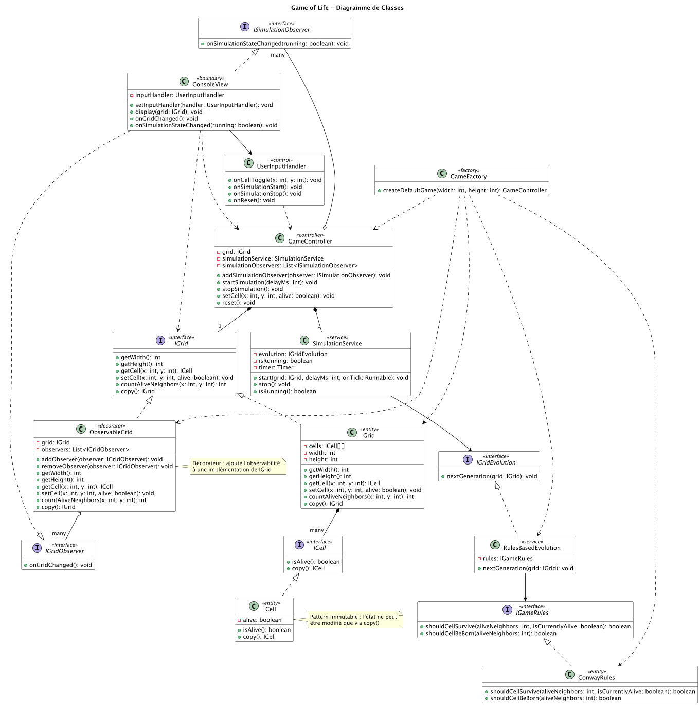
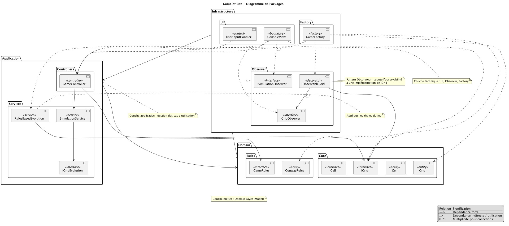
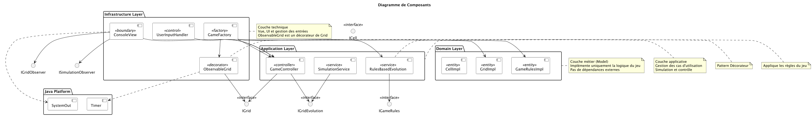
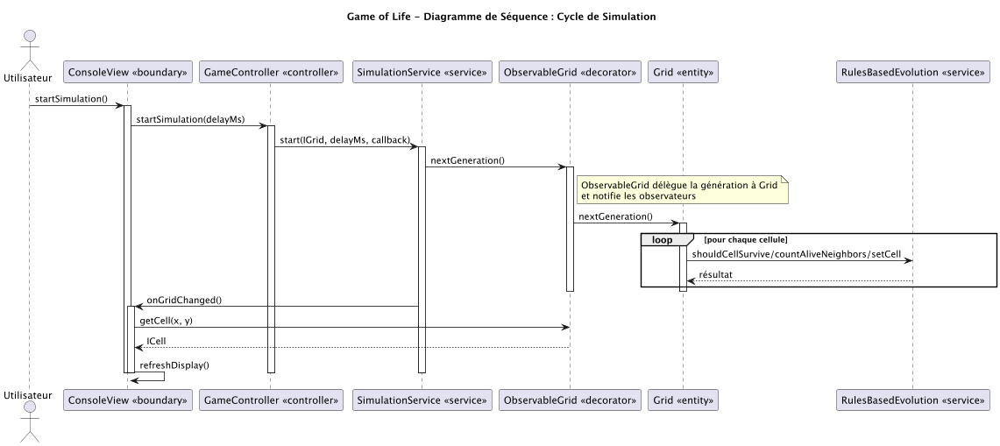
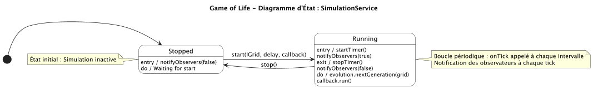

# GameOfLife

_GameOfLife_ est une implémentation du jeu de la vie en Java.

## Documentation

C'est un peu lourd, mais si vous souhaitez jeter un oeil à l'implémentation, voici les diagrammes.

### Diagramme de classe

### Diagramme de package

> Les flèches se chevauchent et c'est illisible. _Il faut que je trouve un moyen d'aérer le diagramme._

### Diagramme de component

> Pareil ici, c'est difficilement déchiffrable 👀

### Diagramme de séquence

### Diagramme d'état

## Ressources

- [Jeu de la vie (Wikipédia)](https://fr.wikipedia.org/wiki/Jeu_de_la_vie)